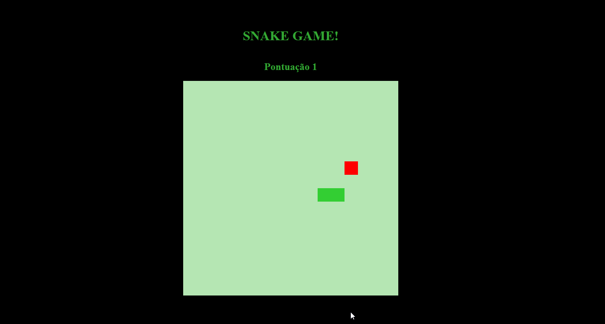

# Jogo da Cobrinha


--- 

Um clássico jogo da cobrinha desenvolvido com **HTML, CSS e JavaScript** para uma experiência visual e interativa no navegador. Desvie do próprio corpo da cobrinha enquanto tenta comer o máximo de maçãs possível para crescer e fazer sua pontuação disparar\!

## Como Jogar

1.  **Mova a Cobrinha**: Use as **setas do teclado** (Cima, Baixo, Esquerda, Direita) para controlar a direção da cobrinha.
2.  **Coma as Maçãs**: Direcione a cobrinha para comer as maçãs que aparecem na tela. Cada maçã comida faz a cobrinha crescer e aumenta sua pontuação.
3.  **Evite Colisões**: Cuidado para não bater no próprio corpo da cobrinha. Se isso acontecer, o jogo termina\!
4.  **Objetivo**: Alcançar a maior pontuação possível\!

## ✨ Funcionalidades

  * **Movimentação Suave**: Controle responsivo da cobrinha.
  * **Geração Aleatória de Maçãs**: As maçãs aparecem em posições aleatórias na tela.
  * **Colisão Inteligente**: Detecção precisa de colisões com o corpo da cobrinha.
  * **Pontuação em Tempo Real**: Veja sua pontuação aumentar a cada maçã coletada.
  * **Game Over**: Tela de fim de jogo com a pontuação final.

## ⚙️ Como Abrir e Jogar

Para rodar o jogo, você só precisa de um navegador web\!

1.  **Clone o Repositório**:

    ```bash
    git clone https://github.com/GabrielaZanetti/jogo-cobrinha.git
    ```

2.  **Navegue até o Diretório do Projeto**:

    ```bash
    cd jogo-cobrinha
    ```

3.  **Abra o arquivo `index.html`**:
    Simplesmente clique duas vezes no arquivo `index.html` no seu explorador de arquivos (ou Finder no macOS). Ele será aberto automaticamente no seu navegador padrão.

    Alternativamente, você pode usar uma extensão de servidor local no seu editor de código (como o "Live Server" para VS Code) para abrir o projeto.

## 👩‍💻 Tecnologias Utilizadas

  * **HTML5**
  * **CSS3**
  * **JavaScript**
